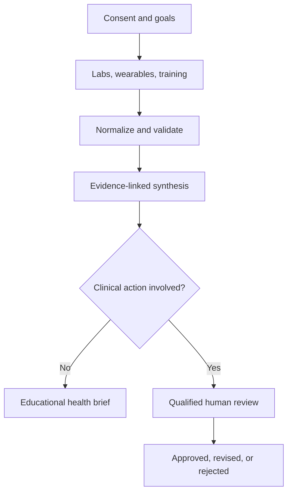

# WellMax Subscription Portal Architecture

Status: product and engineering proposal. This document does not authorize clinical recommendations, a framework migration, collection of health data, authentication, billing, or production deployment.

## Product promise

WellMax should sell continuity, context, and accountable review rather than certainty. The planned subscription connects user goals, laboratory records, wearable trends, training history, medications, and supplements into a longitudinal evidence brief. The system may prepare educational summaries and draft considerations. It must not diagnose, prescribe, determine dosage, construct treatment cycles, or provide self-administration instructions.

## Core workflow

Every transition must create an auditable event. Data integrations should be webhook-driven and idempotent; recurring polling is not the default because it wastes credits and complicates provenance.

## Subscription model

- **Explorer:** public research library, evidence guides, Health Hub, and selected complete profiles.
- **Professional:** permissioned laboratory and wearable connections, a longitudinal personal health brief, saved context, and a professional review queue.
- **Enterprise:** role-based workspaces, assignment and approval queues, audit history, integrations, reporting, and organization-level retention controls.

Pricing remains deferred until authentication, billing, privacy, and review workflows are validated.

## Agent team

| Role | Primary responsibility | Required gate |
| --- | --- | --- |
| WellMax Supervisor | Scope, routing, handoffs, completion evidence | Cannot approve its own work or merge |
| Product & Subscription | Plans, entitlements, activation, retention, honest availability | Human approval for pricing and claims |
| UX & Frontend Design | Accessible journeys, visual system, responsive previews | Visual and accessibility review |
| Application Architecture | Boundaries, events, contracts, failure modes, rollback | Human approval for stack migration |
| Frontend Engineering | Member workspace, state, accessibility, performance | QA and security review |
| Backend & Platform | APIs, jobs, storage boundaries, observability | Privacy and architecture review |
| Identity, Billing & Entitlements | Authentication, subscription state, payment webhooks | Security and finance review |
| Interoperability | FHIR, terminology, provenance, import/export contracts | Conformance tests |
| Laboratory Data | Extraction, units, ranges, LOINC/UCUM, longitudinal quality | Never interprets a result in isolation |
| Wearables Data | Consent, signed webhooks, time-series normalization | Freshness and device-limit checks |
| Training & Recovery | Training-load and recovery context | Contraindication escalation |
| Evidence Research | PubMed search, source grading, citation, uncertainty | Source and freshness checks |
| Draft Synthesis | Cross-source educational brief and open questions | No final clinical authority |
| Clinical Safety | Detects risk, missing context, unsafe output, escalation | Qualified human is clinical approver |
| Privacy & Security | PHI/PII, minimization, encryption, audit, retention | Review before sensitive data |
| AI Evaluation | Golden cases, unsafe-request tests, citation faithfulness | Blocks critical failures |
| QA & Accessibility | Browser, keyboard, responsive, regression, negative paths | Independent PASS |
| SEO & i18n | Discovery, parity, canonicals, translated safety meaning | Human language review |
| Release & Reliability | CI, deployment observation, rollback, incidents | Human merge and release approval |
| Legal/Compliance | Jurisdiction, consent language, claims, contracts | Reserved human authority |

## Installed skill allocation

| Capability | Installed skill(s) | Intended use |
| --- | --- | --- |
| Interoperability | `fhir-developer` | FHIR contracts, validation, terminology, provenance |
| Clinical document intake | `clinical-note-extract`, `doc-extract` | Structured extraction with traceability, never autonomous diagnosis |
| Laboratory ingestion | `terra-lab-reports` | File lifecycle and LOINC/UCUM-aware normalized biomarkers |
| Wearables | `terra-unified-api` | Provider authentication, signed webhooks, idempotency, time series |
| Planned workouts | `terra-planned-workouts` | Device delivery only after product and professional authorization |
| Evidence | `clinical-decision-support`, `scientific-db-pubmed-database` | Reproducible research synthesis and evidence grading |
| Privacy | `healthcare-phi-compliance`, `hipaa-compliance`, `security-review` | PHI boundaries, logging, retention, and security review |
| Agent operations | `team-agent-orchestration`, `agent-architecture-audit`, `delivery-gate` | Routing, contracts, handoffs, independent gates |
| Testing | `tdd-workflow`, `webapp-testing`, `healthcare-eval-harness`, `accessibility` | Unit-to-browser coverage, safety cases, accessibility |
| Frontend quality | `web-design-guidelines`, `react-best-practices` | Current review and future member-app engineering |

`react-best-practices` is reserved for a future application decision. The public repository remains static HTML, CSS, and ES6 until a maintainer explicitly approves a stack change.

## Skills intentionally excluded

- Autonomous peptide or supplement protocol generators that output doses, cycles, washout periods, or self-administration instructions.
- Generic workout generators without screening, contraindication handling, and escalation.
- Local-only health database skills with hard-coded storage and no production consent, tenancy, or audit model.
- Clinical research helpers presented as patient-care tools despite their stated aggregate or synthetic-data scope.

The absence of a trustworthy marketplace skill for personalized peptide protocols is a safety signal, not a gap to bypass. WellMax should implement a bounded draft-and-review capability with its own evaluation suite and qualified professional oversight.

## Data and safety contracts

1. Collect the minimum data required for the stated objective and record consent purpose, version, timestamp, and revocation.
2. Keep raw source, normalized representation, and derived interpretation distinct.
3. Preserve units, reference intervals, source, collection time, timezone, and device identity.
4. Quarantine contradictory identity, impossible unit, stale, or duplicate data.
5. Attach citations and an evidence date to every scientific claim.
6. Mark missing, conflicting, inferred, and low-confidence information.
7. Route medication, supplement, peptide, contraindication, or diagnosis-related output to human review.
8. Never place PHI in URLs, analytics events, client logs, unapproved model boundaries, or browser storage by default.
9. Provide export, correction, revocation, retention, and deletion workflows before launch.

## Delivery sequence

1. Validate demand with the public preview and research library.
2. Define jurisdiction, data map, consent model, and clinical operating model.
3. Prototype identity, entitlements, and billing in a non-clinical sandbox.
4. Build a consented ingestion sandbox using synthetic records.
5. Establish golden evaluation cases and unsafe-request rejection tests.
6. Pilot an educational brief without medication, supplement, or peptide actions.
7. Add a qualified professional review queue and audit trail.
8. Complete privacy, security, accessibility, clinical-safety, and incident-response reviews.
9. Launch to a constrained cohort with monitoring and rollback.

## Launch gates

- Human-approved clinical operating model and claims.
- Privacy impact assessment, threat model, incident plan, and retention policy.
- Identity, billing, entitlement, consent, and deletion end-to-end tests.
- Signed-webhook verification and idempotency tests for every provider.
- Evidence citation faithfulness and stale-source tests.
- Independent accessibility and browser QA.
- Human approval for production release and every material clinical-policy change.
